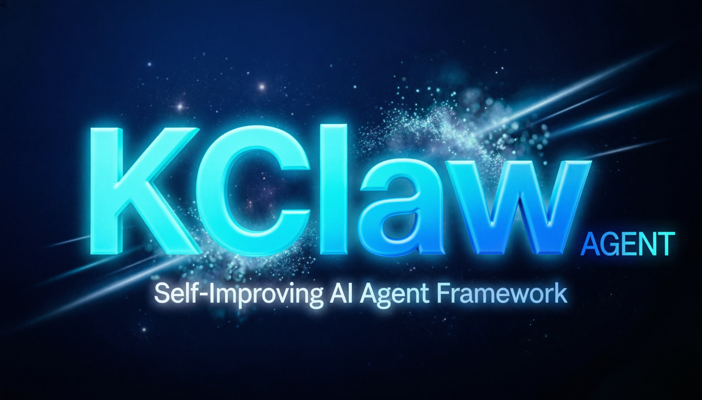

<p align="center">
  
</p>

# KClaw Agent ☤


**由 [kktysllb](https://nousresearch.com) 构建的自改进型 AI 智能体。** 它是唯一内置学习闭环的智能体——从经验中创建技能，使用中自我改进，主动持久化知识，搜索自己的历史对话，并在跨会话中不断深化对你的理解。可以在 VPS 上运行，也可以在 GPU 集群或空闲时几乎零成本的无服务器基础设施上运行。它不局限于你的笔记本——你可以在 Telegram 上与它对话，而它在云虚拟机上工作。

支持任意模型——[Nous Portal](https://portal.nousresearch.com)、[OpenRouter](https://openrouter.ai)（200+ 模型）、[z.ai/GLM](https://z.ai)、[Kimi/Moonshot](https://platform.moonshot.ai)、[MiniMax](https://www.minimax.io)、OpenAI 或你自己的端点。使用 `kclaw model` 切换——无需改代码，无供应商锁定。

<table>
<tr><td><b>真正的终端界面</b></td><td>完整 TUI，支持多行编辑、斜杠命令自动补全、对话历史、中断重定向、流式工具输出。</td></tr>
<tr><td><b>无处不在</b></td><td>Telegram、Discord、Slack、WhatsApp、Signal 和 CLI——全部从单一网关进程运行。语音备忘录转录，跨平台对话连续性。</td></tr>
<tr><td><b>闭环学习</b></td><td>智能体策划的记忆，带周期性自省提示。复杂任务后自主创建技能。技能在使用中自我改进。FTS5 会话搜索配合 LLM 摘要实现跨会话回忆。<a href="https://github.com/plastic-labs/honcho">Honcho</a> 辩证式用户建模。兼容 <a href="https://agentskills.io">agentskills.io</a> 开放标准。</td></tr>
<tr><td><b>定时自动化</b></td><td>内置 cron 调度器，支持向任意平台投递。日报、夜间备份、周审计——全部用自然语言描述，无人值守运行。</td></tr>
<tr><td><b>委派与并行</b></td><td>派生隔离子智能体进行并行工作流。编写通过 RPC 调用工具的 Python 脚本，将多步管道压缩为零上下文开销的轮次。</td></tr>
<tr><td><b>随处运行，不限笔记本</b></td><td>六种终端后端——本地、Docker、SSH、Daytona、Singularity 和 Modal。Daytona 和 Modal 提供无服务器持久化——智能体环境空闲时休眠，按需唤醒，会话间几乎零成本。可在 5 美元 VPS 或 GPU 集群上运行。</td></tr>
<tr><td><b>研究就绪</b></td><td>批量轨迹生成、Atropos RL 环境、轨迹压缩，用于训练下一代工具调用模型。</td></tr>
</table>

---

## 快速安装

```bash
curl -fsSL https://raw.githubusercontent.com/kkutysllb/kk_KClaw/main/scripts/install.sh | bash
```

支持 Linux、macOS 和 WSL2。安装器处理一切——Python、Node.js、依赖和 `kclaw` 命令。唯一前提是 git。

> **Windows：** 不支持原生 Windows。请安装 [WSL2](https://learn.microsoft.com/en-us/windows/wsl/install) 并运行上述命令。

安装后：

```bash
source ~/.bashrc    # 重新加载 shell（或：source ~/.zshrc）
kclaw              # 开始对话！
```

---

## 入门指南

```bash
kclaw              # 交互式 CLI — 开始对话
kclaw model        # 选择 LLM 提供商和模型
kclaw tools        # 配置启用的工具
kclaw config set   # 设置单个配置值
kclaw gateway      # 启动消息网关（Telegram、Discord 等）
kclaw setup        # 运行完整设置向导（一次性配置所有内容）
kclaw claw migrate # 从 OpenClaw 迁移（如果来自 OpenClaw）
kclaw update       # 更新到最新版本
kclaw doctor       # 诊断问题
```

📖 **[完整文档 →](https://kclaw.nousresearch.com/docs/)**

## CLI 与消息平台快速参考

KClaw 有两个入口：用 `kclaw` 启动终端 UI，或运行网关从 Telegram、Discord、Slack、WhatsApp、Signal 或 Email 与之对话。进入对话后，许多斜杠命令在两种界面间共享。

| 操作 | CLI | 消息平台 |
|------|-----|----------|
| 开始对话 | `kclaw` | 运行 `kclaw gateway setup` + `kclaw gateway start`，然后给机器人发消息 |
| 开启新对话 | `/new` 或 `/reset` | `/new` 或 `/reset` |
| 切换模型 | `/model [provider:model]` | `/model [provider:model]` |
| 设置个性 | `/personality [name]` | `/personality [name]` |
| 重试或撤销上一轮 | `/retry`、`/undo` | `/retry`、`/undo` |
| 压缩上下文 / 查看用量 | `/compress`、`/usage`、`/insights [--days N]` | `/compress`、`/usage`、`/insights [days]` |
| 浏览技能 | `/skills` 或 `/<技能名>` | `/skills` 或 `/<技能名>` |
| 中断当前工作 | `Ctrl+C` 或发送新消息 | `/stop` 或发送新消息 |
| 平台特定状态 | `/platforms` | `/status`、`/sethome` |

完整命令列表请参阅 [CLI 指南](https://kclaw.nousresearch.com/docs/user-guide/cli)和[消息网关指南](https://kclaw.nousresearch.com/docs/user-guide/messaging)。

---

## 文档

所有文档位于 **[kclaw.nousresearch.com/docs](https://kclaw.nousresearch.com/docs/)**：

| 章节 | 内容 |
|------|------|
| [快速开始](https://kclaw.nousresearch.com/docs/getting-started/quickstart) | 安装 → 设置 → 2 分钟内开始首次对话 |
| [CLI 使用](https://kclaw.nousresearch.com/docs/user-guide/cli) | 命令、快捷键、个性化、会话 |
| [配置](https://kclaw.nousresearch.com/docs/user-guide/configuration) | 配置文件、提供商、模型、所有选项 |
| [消息网关](https://kclaw.nousresearch.com/docs/user-guide/messaging) | Telegram、Discord、Slack、WhatsApp、Signal、Home Assistant |
| [安全](https://kclaw.nousresearch.com/docs/user-guide/security) | 命令审批、DM 配对、容器隔离 |
| [工具与工具集](https://kclaw.nousresearch.com/docs/user-guide/features/tools) | 40+ 工具、工具集系统、终端后端 |
| [技能系统](https://kclaw.nousresearch.com/docs/user-guide/features/skills) | 程序性记忆、技能中心、创建技能 |
| [记忆](https://kclaw.nousresearch.com/docs/user-guide/features/memory) | 持久记忆、用户画像、最佳实践 |
| [MCP 集成](https://kclaw.nousresearch.com/docs/user-guide/features/mcp) | 连接任意 MCP 服务器扩展能力 |
| [定时调度](https://kclaw.nousresearch.com/docs/user-guide/features/cron) | 定时任务与平台投递 |
| [上下文文件](https://kclaw.nousresearch.com/docs/user-guide/features/context-files) | 塑造每次对话的项目上下文 |
| [架构](https://kclaw.nousresearch.com/docs/developer-guide/architecture) | 项目结构、智能体循环、关键类 |
| [贡献](https://kclaw.nousresearch.com/docs/developer-guide/contributing) | 开发设置、PR 流程、代码风格 |
| [CLI 参考](https://kclaw.nousresearch.com/docs/reference/cli-commands) | 所有命令和标志 |
| [环境变量](https://kclaw.nousresearch.com/docs/reference/environment-variables) | 完整环境变量参考 |

---

## 从 OpenClaw 迁移

如果你来自 OpenClaw，KClaw 可以自动导入你的设置、记忆、技能和 API 密钥。

**首次设置时：** 设置向导（`kclaw setup`）会自动检测 `~/.openclaw` 并在配置开始前提供迁移选项。

**安装后随时：**

```bash
kclaw claw migrate              # 交互式迁移（完整预设）
kclaw claw migrate --dry-run    # 预览将要迁移的内容
kclaw claw migrate --preset user-data   # 仅迁移用户数据，不含密钥
kclaw claw migrate --overwrite  # 覆盖已有冲突
```

导入内容：
- **SOUL.md** — 人设文件
- **记忆** — MEMORY.md 和 USER.md 条目
- **技能** — 用户创建的技能 → `~/.kclaw/skills/openclaw-imports/`
- **命令白名单** — 审批模式
- **消息设置** — 平台配置、允许的用户、工作目录
- **API 密钥** — 允许的密钥（Telegram、OpenRouter、OpenAI、Anthropic、ElevenLabs）
- **TTS 资源** — 工作区音频文件
- **工作区指令** — AGENTS.md（使用 `--workspace-target`）

运行 `kclaw claw migrate --help` 查看所有选项，或使用 `openclaw-migration` 技能进行交互式向导迁移（带预览）。

---

## 贡献

欢迎贡献！请参阅[贡献指南](https://kclaw.nousresearch.com/docs/developer-guide/contributing)了解开发设置、代码风格和 PR 流程。

贡献者快速开始：

```bash
git clone https://github.com/kkutysllb/kk_KClaw.git
cd kclaw
curl -LsSf https://astral.sh/uv/install.sh | sh
uv venv venv --python 3.11
source venv/bin/activate
uv pip install -e ".[all,dev]"
python -m pytest tests/ -q
```

> **RL 训练（可选）：** 如需参与 RL/Tinker-Atropos 集成开发：
> ```bash
> git submodule update --init tinker-atropos
> uv pip install -e "./tinker-atropos"
> ```

---

## 社区

- 💬 [Discord](https://discord.gg/NousResearch)
- 📚 [技能中心](https://agentskills.io)
- 🐛 [问题追踪](https://github.com/kkutysllb/kk_KClaw/issues)
- 💡 [讨论区](https://github.com/kkutysllb/kk_KClaw/discussions)

---

## 许可证

MIT — 详见 [LICENSE](LICENSE)。

由 [kkutysllb](https://nousresearch.com) 构建。
